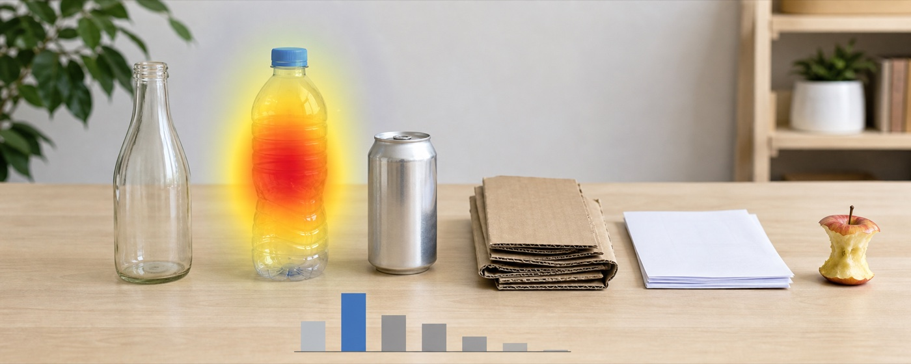
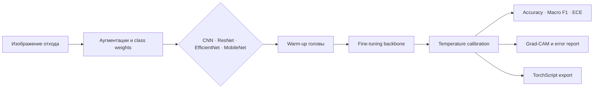

# EcoSort: классификация отходов с объяснением решений



EcoSort классифицирует фотографию в один из семи классов: пластик, стекло, бумага, металл, картон, органика и прочее. Вместе с вероятностями система строит Grad-CAM-карту и показывает, на какую область опиралась модель, после чего выдаёт рекомендацию по утилизации.

## Архитектура решения



Дополнительные предметные каталоги:

- `labeling_guide/` — таксономия классов, неоднозначные случаи и checklist ревью;
- `model_cards/` — шаблон выпуска модели с качеством, ограничениями и SHA-256.

## Состав проекта

- простой CNN baseline;
- ResNet18/50, EfficientNet-B0 и MobileNetV3 Small с ImageNet-весами;
- head-only обучение и полный fine-tuning;
- аугментации, label smoothing и компенсация дисбаланса class weights;
- accuracy, macro F1, precision/recall по классам, confusion matrix, latency и размер checkpoint;
- Grad-CAM без внешней XAI-библиотеки;
- двухфазный fine-tuning с разными learning rate для head/backbone и выбором по macro F1;
- temperature scaling, Expected Calibration Error и версионируемый TorchScript export;
- CLI обучения/оценки и веб-демо.

## Данные

Подойдут TrashNet, Garbage Classification Dataset или объединённый собственный набор с проверенной лицензией. Приведите названия каталогов к классам из конфигурации:

```text
data/
├── train/{plastic,glass,paper,metal,cardboard,organic,other}/
├── val/{plastic,glass,paper,metal,cardboard,organic,other}/
└── test/{plastic,glass,paper,metal,cardboard,organic,other}/
```

Удаляйте почти одинаковые кадры до split и не допускайте, чтобы снимки одного физического объекта/серии попали в разные части. Зафиксируйте источник, лицензию, число примеров и распределение классов в datasheet.

## Запуск

```bash
python -m venv .venv
source .venv/bin/activate
pip install -e '.[train,demo,dev]'
ecosort-train --config configs/efficientnet.yaml --output checkpoints/efficientnet_b0.pt
ecosort-evaluate --checkpoint checkpoints/efficientnet_b0.pt --data data
ecosort-calibrate --checkpoint checkpoints/efficientnet_b0.pt --data data
ecosort-export --checkpoint checkpoints/efficientnet_b0.pt --output exports/ecosort.ts
ecosort-error-report --checkpoint checkpoints/efficientnet_b0.pt --data data --limit 30
python scripts/plot_results.py --input reports/results.csv
streamlit run app.py
pytest -q
```

## Экспериментальный протокол

Матрица вариантов находится в `configs/experiments.yaml`. Сначала обучите SimpleCNN без аугментаций. Затем сравните одинаковые pretrained-модели в режиме head-only и full fine-tuning. После этого отдельно включите аугментации и class weights. Не меняйте test split при подборе.

Для каждой модели публикуйте `accuracy`, `macro_f1`, per-class precision/recall, latency batch=1 после warm-up, размер файла и число параметров. Тяжёлая модель считается оправданной только при измеримом выигрыше macro F1. Отчёт должен включать confusion matrix и минимум 20 ошибок с исходным фото, true/predicted классом, confidence и Grad-CAM.

## Как интерпретировать Grad-CAM

Grad-CAM показывает чувствительные области последнего convolutional layer, но не доказывает причинность. Хороший пример подсвечивает сам объект. Плохой — фон, руку, водяной знак или упаковку рядом. Проверяйте объяснения и на правильных, и на ошибочных ответах; добавьте sanity check с рандомизированными весами. Не скрывайте случаи, где карта диффузна.

## Практические ограничения

Рекомендации по утилизации общие: реальные правила зависят от города, маркировки и загрязнения. Интерфейс не должен выдавать опасные отходы, батарейки, электронику или медицинские отходы за обычный мусор; для них нужен отдельный high-risk класс и локальная справочная база. При низкой уверенности production-система должна просить дополнительный снимок или выбирать `other` после калибровки порога.

Для мобильного использования сравните MobileNet, ONNX Runtime и post-training quantization. Перед внедрением нужны калибровка confidence, out-of-distribution тест, оценка разных камер/освещения и мониторинг распределения классов.
